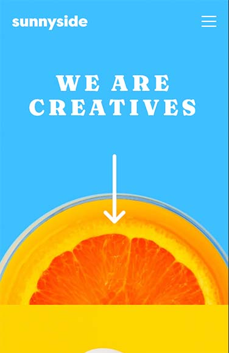
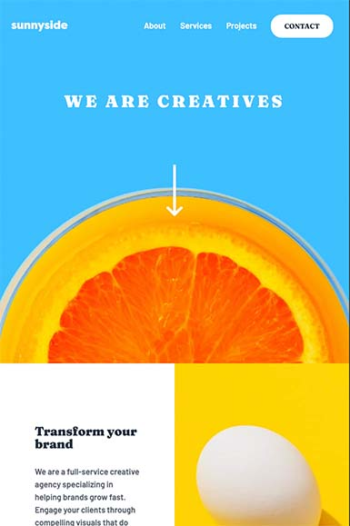

# Frontend Mentor - Sunnyside agency landing page solution

This is a solution to the [Sunnyside agency landing page challenge on Frontend Mentor](https://www.frontendmentor.io/challenges/sunnyside-agency-landing-page-7yVs3B6ef). Frontend Mentor challenges help you improve your coding skills by building realistic projects.

## Table of contents

- [Overview](#overview)
  - [The challenge](#the-challenge)
  - [Screenshots](#screenshots)
  - [Links](#links)
- [My process](#my-process)
  - [Built with](#built-with)
  - [What I learned](#what-i-learned)
- [Author](#author)

## Overview

### The challenge

Users should be able to:

- View the optimal layout for the site depending on their device's screen size
- See hover states for all interactive elements on the page

### Screenshots





### Links

- Solution URL: [https://github.com/tiffanyyee/sunnyside-agency-landing-page]
- Live Site URL: [https://tiffanyyee.github.io/sunnyside-agency-landing-page]

## My process

### Built with

- Semantic HTML5 markup
- CSS3, including using Flexbox, animation, and hover states
- Mobile-first workflow / Responsive design
- JavaScript for hamburger menu function

### What I learned

Some snippets of my code learnings:

```html
<!-- HTML for the hamburger menu -->
<a href="javascript:void(0);" class="icon" onclick="menuToggle()">
  
</a>

<!-- HTML for the side-by-side images -->
<div class="row">
  <div class="column image-first">
  </div>
  <div class="column image-second">
  </div>
  <div class="column image-third">
  </div>
  <div class="column image-fourth">
  </div>
</div>
```

```css
/* CSS using clip-path to create the triangle notch at top right corner of hamburger nav */
#navLinks {
    clip-path: polygon(94% 7%, 100% 0, 100% 100%, 0 100%, 0 7.5%);
}

/* CSS for underline animation on hover */
.yellow-underline {
    background-image: linear-gradient(120deg, hsl(51, 100%, 49%) 0%, yellow 100%);
    background-repeat: no-repeat;
    background-size: 100% 0.2em;
    background-position: 0 88%;
}
.yellow-underline:hover {
    transition: 0.25s ease-in;  
    background-size: 100% 88%;
}

/* CSS for side-by-side images */
.column {
    float: left;
    width: 50%;
}
.row::after {
    content: "";
    clear: both;
    display: table;
}
```

```js
// JavaScript for toggling hamburger menu display
function menuToggle() {
    var menu = document.getElementById("navLinks");
    if (menu.style.display === "block") {
      menu.style.display = "none";
    } else {
      menu.style.display = "block";
    }
}
```

## Author

- Tiffany Yee - [Portfolio](https://tiffanyyee.github.io), [GitHub](https://github.com/tiffanyyee)
- Frontend Mentor - [https://www.frontendmentor.io]
